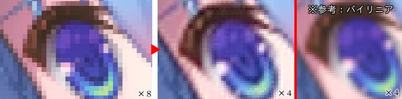

 

# Palesibyl, the deep learning library

`Palesibyl（ペイルシビラ）`は C++ 用深層学習ライブラリです。

64bit Windows / Linux、GPU（CUDA）/ x86_64 CPU で動作します（CUDA 無しでも動作します）。  

このライブラリは深層学習の基礎を｛学ぶため｜学びながら｝個人的に開発したものであり、玩具のようなものです。*実用性は保証しません。*

深層学習技術は既に民主化されており、民主化された市民ならばそれら実用的なライブラリを使用することでしょう。  
技術が民主化されれば難しいことを理解せずとも言わば「ボタンの押し方」を覚えるだけで素晴らしい技術の恩恵に浴することができる、素晴らしい世界です。

しかし市民が「ボタンの押し方」を覚えたことをもって本当に「技術が民主化された」と言えるでしょうか？  
ボタンが民主化されただけなのでは？  
民主化されていない未開の民はそう思ってしまうのです。

電卓を使うのに内部の回路をすべて理解しておく必要はありません。  
しかし電卓は魔法の箱ではなく、いわば種も仕掛けもあるマジックなのです。

*「凄い！ こんなことが出来るなら、きっと『あんなこと』も出来るはずだ！」*

という類推は、マジックの種を知らなければ往々にして正しくありません。  
「マジック蛇口」を何もないところに突き刺し、あるいは空中から、蛇口をひねれば水が出ることを期待してしまいます。  
そんな例え話「ありえない」と笑われるかもしれません。  

しかしこれを笑っていいのは、BASIC言語<sup>※</sup>を学ぶ前に *「方程式を入力したら解を計算してくれんでしょ？」* なんていうようなことを思ってなかった人だけでしょう。  
<sup>※現在は方程式を解くアプリが普通にあるのでこの喩えでは昔のBASIC言語としました。しかしプログラミング言語においてこの喩えは現在も有効です。</sup>

実際、技術者が考える「簡単な事」と「難しい事」が、非技術者と乖離するというシチュエーションは多くの技術者が経験することです。  
そのような経験をしておきながら、仕組みを知らなくていい、種も仕掛けも知らなくていい、道具の使い方、「ボタンの押し方」だけ覚えればいいと思う技術者は少ない筈です。

私がこの深層学習ライブラリ `Palesibyl` を作るにあたって、電卓に例えるならばフリップフロップや論理素子の動作原理を学びたくて作ったと言えます。未開の民は電卓を使う前にせめてそのくらいの事は理解しておきたいと思ってしまうのです。

皆さんも皆さんの深層学習ライブラリを作りましょう！  
未開の民にとって「**車輪の再開発**」は必ずしも悪ではありません。真の技術の民主化を。Good Luck!

 


## ディレクトリ

- `README.md` - このファイル
- `LICENSE` - ライセンス情報
- `build/Palesibyl/` - Visual Studio 用ソリューション
- `Palesibyl/include/` - C++ 用ヘッダファイル
- `Palesibyl/library/` - C++ 用ライブラリファイル
- `samples/` - 各サンプル実行用


## ビルド

* Windows  
  ビルドには Visual Studio 及び NVIDIA CUDA Toolkit が必要です。  
  （開発時点では Visual Studio 2019 及び NVIDIA CUDA Toolkit 12 を使用しています）

  インストールした上で `build/Palesibyl/Palesibyl.sln` を Visual Studio で開きビルドを実行してください。  
  <sup>※Debug ビルドは重すぎて実行には不向きですので、デバッグ／検証以外の場合には Release でビルドしてください。</sup>

* Linux  
  ビルドには CMake 及び C++ コンパイラ類、NVIDIA CUDA Toolkit、OpenCV（画像コーデックとして）が必要です。  
  （Ubuntu on WSL2 環境<sup>※</sup>、NVIDIA CUDA Toolkit 12 でビルドを確認しています。11 の nvcc では標準ライブラリヘッダ内でエラーが出てビルドできませんでした）

  CMake で `build/CMakeLists.txt` からビルドしてください。

  ```bash
  $ cd build
  $ cmake .
  $ make
  ```

  <sup>※WSLではCUDAで確保できるデバイスメモリの上限が物理メモリの半分に制限されるらしいので、WSLを使わずWindowsで直接動かしたほうが良いです。</sup>


## サンプルコード

詳細は [build/README.md](./build/README.md) 及び、各サンプルプロジェクト内 README.md を参照

### [simple_color_filter](./build/simple_color_filter/)

* ピクセル毎の単純な色空間変換を模擬します。  
  

  ```cpp
  mlp.AppendLayer( 3, 3, 1, activLinear ) ;
  ```


### [simple_upsampler](./build/simple_upsampler/)

* 画像を2倍に拡大します。多少いい感じに補完します。  
  

  ```cpp
  mlp.AppendConvLayer( 64, 3, 3, 3, convPadBorder, 1, activReLU ) ;
  mlp.AppendUp2x2Layer( 16, 64, 1, activReLU ) ;
  mlp.AppendConvLayer( 3, 16, 3, 3, convPadZero, 1, activLinear ) ;
  ```


### [simple_classifier](./build/simple_classifier/)

* 16x16グレイスケール画像の単純な画像分類器です。

  ```cpp
  mlp.AppendConvLayer( 16, 1, 3, 3, convPadBorder, 1, activReLU ) ;       // 16x16
  mlp.AppendMaxPoolLayer( 16, 2, 2 ) ;                                    // 8x8
  mlp.AppendConvLayer( 32, 16, 3, 3, convPadZero, 1, activReLU ) ;
  mlp.AppendMaxPoolLayer( 32, 2, 2 ) ;                                    // 4x4
  mlp.AppendConvLayer( 64, 32, 3, 3, convPadZero, 1, activReLU, 2, 2 ) ;  // 2x2
  mlp.AppendConvLayer( 128, 64, 2, 2, convNoPad, 0, activReLU, 2, 2 ) ;   // 1x1
  mlp.AppendLayer( nClassCount, 128, 1, activSoftmax ) ;
  ```


### [simple_gan](./build/simple_gan/)

* 単純な画像生成器です。  
    
  画像分類器を使って敵対的生成ネットワークで学習させます。  
  生成条件もないので、分類毎に決まった画像を出力します。

  ```cpp
  mlp.AppendLayer( 128, nClassCount, 1, activLinear ) ;       // 1x1
  mlp.AppendUp2x2Layer( 64, 128, 1, activLinear ) ;           // 2x2
  mlp.AppendUp2x2Layer( 32, 64, 1, activLinear ) ;            // 4x4
  mlp.AppendUp2x2Layer( 16, 32, 1, activLinear ) ;            // 8x8
  mlp.AppendUp2x2Layer( 1, 16, 1, activLinear ) ;             // 16x16
  ```


### [simple_wave_filter](./build/simple_wave_filter/)

* 単純な RNN での音声フィルタです。イコライザを模擬します。  
  入力を4サンプル毎にしているのは処理を少し軽くするためで、本当は1サンプル毎のほうがいいでしょう。  
  少しづつチャネル数を増やして出来るだけ広い周波数帯の特性に対応できることを期待しています。

  ```cpp
  mlp.AppendLayer( 4, 4, 0, activLinear ) ;
  mlp.AppendLayer( 8, 12, 0, activLinear )
      ->AddConnection( 1, 0, 0, 4 )            // 直前レイヤーから  : 4チャネル入力
      ->AddConnection( 0, 1, 0, 8 ) ;          // このレイヤー(t-1) : 8チャネル入力
  mlp.AppendLayer( 16, 24, 0, activLinear )
      ->AddConnection( 1, 0, 0, 8 )
      ->AddConnection( 0, 1, 0, 16 ) ;
  mlp.AppendLayer( 32, 48, 0, activLinear )
      ->AddConnection( 1, 0, 0, 16 )
      ->AddConnection( 0, 1, 0, 32 ) ;
  mlp.AppendLayer( 64, 96, 0, activLinear )
      ->AddConnection( 1, 0, 0, 32 )
      ->AddConnection( 0, 1, 0, 64 ) ;
  mlp.AppendLayer( 4, 64, 0, activLinear ) ;
  ```


### [sample_resnet](./build/sample_resnet/)

* モノクロ画像への着色を学習させたい ResNet を使ったサンプルです。  
  

  ```cpp
  for ( int i = 0; i < 10; i ++ )
  {
      mlp.AppendConvLayer( 64, 64, 3, 3, convPadZero, 0, activReLU )
          ->SetRidgeParameter( 0.01f )
          ->SetAdaptiveOptimization( NNPerceptron::adaOptMomentum, adaParam )
          ->SetNormalization( std::make_shared<NNInstanceNormalization>(normParam) ) ;
  
      NNPerceptronPtr    pResidual =
          mlp.AppendConvLayer( 64, 64, 3, 3, convPadZero, 0, activLinear ) ;
      pResidual
          ->SetRidgeParameter( 0.01f )
          ->SetAdaptiveOptimization( NNPerceptron::adaOptMomentum, adaParam )
          ->SetNormalization( std::make_shared<NNInstanceNormalization>(normParam) ) ;
  
      pPrevLayer =
          mlp.AppendPointwiseAdd( 64, pResidual, 0, pPrevLayer, 0, activReLU ) ;
  }
  ```


### [sample_unet](./build/sample_unet/)

* モノクロ画像への着色を学習させたい U-Net を使ったサンプルです。

  ```cpp
  NNPerceptronPtr    pSkip0, pSkip1, pSkip2, pSkip3 ;
  mlp.AppendConvLayer( 64, 4, 3, 3, convPadBorder, bias, activReLU ) ;
  pSkip0 = mlp.AppendConvLayer( 64, 64, 3, 3, convPadZero, bias, activReLU ) ;
  mlp.AppendMaxPoolLayer( 64, 2, 2 ) ;                        // 1/2
  mlp.AppendConvLayer( 128, 64, 3, 3, convPadZero, bias, activReLU ) ;
  pSkip1 = mlp.AppendConvLayer( 128, 128, 3, 3, convPadZero, bias, activReLU ) ;

  mlp.AppendMaxPoolLayer( 128, 2, 2 ) ;                       // 1/4
  mlp.AppendConvLayer( 256, 128, 3, 3, convPadZero, bias, activReLU ) ;
  pSkip2 = mlp.AppendConvLayer( 256, 256, 3, 3, convPadZero, bias, activReLU ) ;

  mlp.AppendMaxPoolLayer( 256, 2, 2 ) ;                       // 1/8
  mlp.AppendConvLayer( 512, 256, 3, 3, convPadZero, bias, activReLU ) ;
  pSkip3 = mlp.AppendConvLayer( 512, 512, 3, 3, convPadZero, bias, activReLU ) ;

  mlp.AppendMaxPoolLayer( 512, 2, 2 ) ;                       // 1/16
  mlp.AppendConvLayer( 1024, 512, 3, 3, convNoPad, bias, activReLU ) ;

  mlp.AppendConvLayer( 1024, 1024, 3, 3, convNoPad, bias, activReLU ) ;

  mlp.AppendUp2x2Layer( 512, 1024, 1, activReLU ) ;           // 1/8
  mlp.AppendConvLayer( 512, 512+512, 3, 3, convPadZero, bias, activReLU )
          ->AddConnection( 1, 0, 0, 512 )                     // ※１つ前のレイヤーと
          ->AddConnection( mlp.LayerOffsetOf(pSkip3),
                                  0, 0, 512, trim3, trim3 ) ; // pSkip3 から入力する
  mlp.AppendConvLayer( 512, 512, 3, 3, convPadZero, bias, activReLU ) ;

  mlp.AppendUp2x2Layer( 256, 512, 1, activReLU ) ;            // 1/4
  mlp.AppendConvLayer( 256, 256+256, 3, 3, convPadZero, bias, activReLU )
          ->AddConnection( 1, 0, 0, 256 )
          ->AddConnection( mlp.LayerOffsetOf(pSkip2), 0, 0, 256, trim2, trim2 ) ;
  mlp.AppendConvLayer( 256, 256, 3, 3, convPadZero, bias, activReLU ) ;

  mlp.AppendUp2x2Layer( 128, 256, 1, activReLU ) ;            // 1/2
  mlp.AppendConvLayer( 128, 128+128, 3, 3, convPadZero, bias, activReLU )
          ->AddConnection( 1, 0, 0, 128 )
          ->AddConnection( mlp.LayerOffsetOf(pSkip1), 0, 0, 128, trim1, trim1 ) ;
  mlp.AppendConvLayer( 128, 128, 3, 3, convPadZero, bias, activReLU ) ;

  mlp.AppendUp2x2Layer( 64, 128, 1, activReLU ) ;             // 1/1
  mlp.AppendConvLayer( 64, 64+64, 3, 3, convPadZero, bias, activReLU )
          ->AddConnection( 1, 0, 0, 64 )
          ->AddConnection( mlp.LayerOffsetOf(pSkip0), 0, 0, 64, trim0, trim0 ) ;
  mlp.AppendConvLayer( 64, 64, 3, 3, convPadZero, bias, activReLU ) ;
  mlp.AppendLayer( 4, 64, bias, activTanh ) ;
  ```


## ライセンス

Palesibyl は GPLv3 ライセンスで提供されます。

Copyright (c) 2023, Leshade Entis.

Palesibyl is free software: you can redistribute it and/or modify it under the terms of the GNU General Public License as published by the Free Software Foundation, either version 3 of the License, or (at your option) any later version.
This program is distributed in the hope that it will be useful, but WITHOUT ANY WARRANTY; without even the implied warranty of MERCHANTABILITY or FITNESS FOR A PARTICULAR PURPOSE. See the GNU General Public License for more details.
You should have received a copy of the GNU General Public License along with this program.
If not, see <https://www.gnu.org/licenses/>.